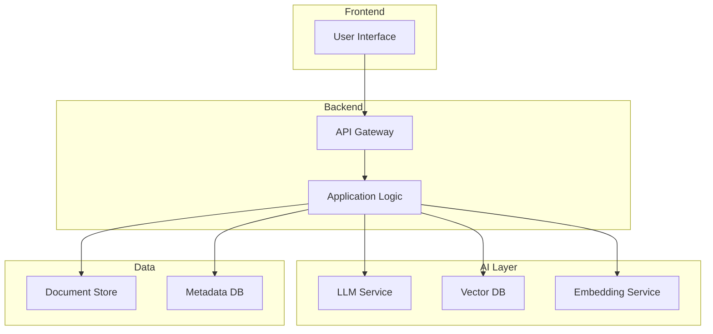

# /prototype - AI Architecture Prototyping Command

**Purpose**: Guide through a structured process to create production-ready AI architecture prototypes using enterprise patterns and AI CoE methodology.

## Command Invocation

- `/prototype` - Start the guided wizard
- `/prototype ai-architecture` - Start with AI Architecture context
- `/prototype [use-case]` - Start with a specific use case in mind

---

## Phase 1: Discovery (5-10 min)

### Objective
Understand the business problem, technical constraints, and success criteria before selecting any patterns or technologies.

### Questions to Ask

**Business Context:**
1. What business problem are we solving?
2. Who are the primary users/stakeholders?
3. What does success look like? (KPIs, metrics)
4. What's the project scope? (PoC / MVP / Production)
5. What's the timeline and budget?

**Technical Context:**
1. Which cloud provider(s)? (AWS, GCP, Azure, OCI, Multi-cloud)
2. Existing infrastructure and services?
3. Security and compliance requirements?
4. Integration points (APIs, databases, systems)?
5. Team expertise and constraints?

**AI Use Case:**
1. What type of AI workload?
   - Document Q&A / RAG
   - Autonomous Agents
   - Content Generation
   - Code Assistance
   - Data Analysis
   - Other
2. Expected scale (users, requests/day)?
3. Latency requirements?
4. Data sensitivity (public, internal, PII, PHI)?

### Discovery Template

```markdown
## Architecture Prototype: [NAME]

### Business Context
- **Problem**: [What problem does this solve?]
- **Stakeholders**: [Who benefits?]
- **Success Metrics**: [How will we measure success?]
- **Scope**: PoC / MVP / Production
- **Timeline**: [Expected timeline]

### Technical Context
- **Cloud Provider(s)**: [AWS / GCP / Azure / OCI / Multi-cloud]
- **Existing Infrastructure**: [What already exists?]
- **Security Requirements**: [Compliance, data handling]
- **Integrations**: [APIs, databases, systems]
- **Team Expertise**: [What the team knows]

### AI Use Case
- **Type**: [RAG / Agents / Generation / etc.]
- **Scale**: [Users, requests/day]
- **Latency**: [Requirements]
- **Data Sensitivity**: [Classification]
```

---

## Phase 2: Pattern Selection (5 min)

### Objective
Match the use case to appropriate enterprise patterns from the AI Architect Academy pattern library.

### Pattern Matching Guide

| Use Case | Primary Pattern | Supporting Patterns |
|----------|-----------------|---------------------|
| Document Q&A | RAG Production | Vector DB, AI Gateway |
| Customer Support Bot | RAG Production | Multi-Agent, Security |
| Autonomous Coding | Multi-Agent Orchestration | MCP Servers, LLMOps |
| Enterprise AI Platform | AI Gateway | AI CoE, Security, Cost Opt |
| Content Generation | AI Gateway | LLMOps, Observability |
| Data Analysis | RAG Production | AI Gateway, Cost Opt |

### Available Patterns

1. **AI Gateway** - Unified access, auth, rate limiting
2. **RAG Production** - Document retrieval and augmented generation
3. **Multi-Agent Orchestration** - Coordinated autonomous agents
4. **MCP Servers** - Standardized tool integration
5. **LLMOps** - Versioning, evaluation, deployment
6. **Vector DB Selection** - Right-sizing vector storage
7. **AI CoE Framework** - Enterprise governance
8. **Security & Governance** - Guardrails and compliance

### Pattern Selection Template

```markdown
## Selected Patterns

### Primary Pattern: [PATTERN NAME]
- **Why**: [Justification for selection]
- **Key Components**: [What it provides]

### Supporting Patterns
1. **[Pattern]**: [Why needed]
2. **[Pattern]**: [Why needed]

### Rejected Patterns
- **[Pattern]**: [Why not appropriate]
```

---

## Phase 3: Architecture Design (15-30 min)

### Objective
Design the technical architecture with components, data flows, and cloud service mappings.

### Design Process

1. **Component Identification**
   - List all required components
   - Map to cloud services
   - Define interfaces

2. **Data Flow Design**
   - Document data sources
   - Map transformation points
   - Define storage requirements

3. **Security Design**
   - Authentication/authorization
   - Data encryption
   - Audit logging

4. **Cost Estimation**
   - Compute costs
   - Storage costs
   - API costs
   - Operational overhead

### Architecture Diagram

Generate a Mermaid diagram:



### Component Specification Template

```markdown
## Component: [NAME]

### Purpose
[What this component does]

### Cloud Service
[AWS/GCP/Azure/OCI service mapping]

### Configuration
- CPU/Memory: [Requirements]
- Scaling: [Auto-scaling rules]
- Networking: [VPC, security groups]

### Dependencies
- [Upstream components]
- [Downstream components]

### Cost Estimate
- Monthly: $[amount]
- Assumptions: [scaling, usage]
```

---

## Phase 4: Implementation Plan (10 min)

### Objective
Create a phased implementation roadmap with clear deliverables, resource requirements, and risk mitigation.

### Phase Structure

**Phase 1: Foundation (Weeks 1-2)**
- Infrastructure setup
- Core services deployment
- Basic integration testing

**Phase 2: Core Features (Weeks 3-4)**
- Primary AI components
- Data pipelines
- Initial testing

**Phase 3: Integration (Weeks 5-6)**
- System integration
- Security hardening
- Performance optimization

**Phase 4: Production (Weeks 7-8)**
- Load testing
- Documentation
- Deployment & monitoring

### Risk Assessment Template

```markdown
| Risk | Impact | Probability | Mitigation |
|------|--------|-------------|------------|
| [Risk 1] | High/Med/Low | High/Med/Low | [Action] |
| [Risk 2] | High/Med/Low | High/Med/Low | [Action] |
```

---

## Phase 5: Output Generation

### Deliverables

Generate complete prototype documentation in this structure:

```
prototypes/[prototype-id]/
├── README.md              # Overview and quick start
├── ARCHITECTURE.md        # Detailed architecture
├── IMPLEMENTATION.md      # Step-by-step implementation guide
├── COST_ESTIMATE.md       # Cost breakdown and assumptions
├── diagrams/
│   ├── architecture.mmd   # Mermaid source
│   └── data-flow.mmd      # Data flow diagram
├── code/
│   ├── terraform/         # Infrastructure as Code
│   ├── python/            # Python implementations
│   └── typescript/        # TypeScript implementations
└── tests/
    └── integration/       # Integration test specifications
```

### README Template

```markdown
# [Prototype Name]

> [One-line description]

## Overview

[2-3 paragraph overview of the architecture and its purpose]

## Quick Start

1. [Step 1]
2. [Step 2]
3. [Step 3]

## Architecture


### Key Components

| Component | Purpose | Technology |
|-----------|---------|------------|
| [Name] | [Purpose] | [Tech] |

## Cost Estimate

| Category | Monthly | Annual |
|----------|---------|--------|
| Compute | $X | $X |
| Storage | $X | $X |
| AI/ML | $X | $X |
| **Total** | **$X** | **$X** |

## Implementation Timeline

- **Phase 1** (2 weeks): Foundation
- **Phase 2** (2 weeks): Core Features
- **Phase 3** (2 weeks): Integration
- **Phase 4** (2 weeks): Production

## Related Patterns

- [Pattern 1](link)
- [Pattern 2](link)

## Resources

- [AI Architect Academy](https://github.com/frankxai/ai-architect-academy)
- [Pattern Library](https://frankx.ai/ai-architect-academy/patterns)
```

---

## Agent Activation

When this command is invoked, channel the following agent personas:

### Primary: AI Architect
- Enterprise architecture expertise
- Multi-cloud platform knowledge
- Pattern selection wisdom
- Cost optimization mindset
- Security-first thinking

### Support: Technical Translator
- Make complex concepts accessible
- Ensure documentation clarity
- Bridge technical and business language

---

## Related Commands

- `/skill ai-architecture-patterns` - Deep dive into specific patterns
- `/skill mcp-architecture` - MCP server design guidance
- `/skill claude-sdk` - Agent development patterns
- `/skill oci-services-expert` - OCI-specific guidance

---

## Quality Checklist

Before completing a prototype, verify:

- [ ] Business problem clearly articulated
- [ ] Patterns selected with justification
- [ ] Architecture diagram complete
- [ ] All components specified
- [ ] Data flows documented
- [ ] Security considerations addressed
- [ ] Cost estimates provided with assumptions
- [ ] Implementation phases defined
- [ ] Risks identified with mitigations
- [ ] README is comprehensive

---

## Examples

### Example 1: Enterprise RAG Platform

```
/prototype Document Q&A for internal knowledge base

Discovery reveals:
- 50K employees need access
- SharePoint and Confluence as sources
- PII present in some documents
- OCI as primary cloud

Pattern Selection:
- Primary: RAG Production
- Support: Vector DB Selection, Security & Governance, AI Gateway

Architecture: [See prototypes/enterprise-rag-platform]
```

### Example 2: Multi-Agent Code Assistant

```
/prototype Autonomous coding system for development team

Discovery reveals:
- 20 developers
- TypeScript/Python codebase
- GitHub integration required
- Cost-sensitive (startup)

Pattern Selection:
- Primary: Multi-Agent Orchestration
- Support: MCP Servers, LLMOps

Architecture: [See prototypes/multi-agent-code-assistant]
```

---

*This command is part of the AI Architect Academy by FrankX.AI*
*GitHub: https://github.com/frankxai/ai-architect-academy*
